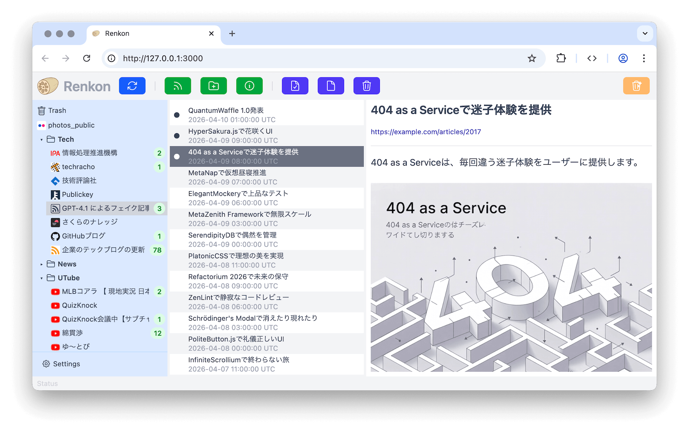

# Renkon

Japanese version: [README.ja.md](README.ja.md)

Renkon is a simple web-based RSS reader designed to run as a self-hosted personal server.

- Three-pane layout
- Keyboard-driven navigation
- Lightweight article preview based only on RSS feed contents
- OPML import and export support

Renkon is currently in alpha. More features are planned.



## Requirements

You can run Renkon with Docker on any environment where Docker Engine is available.

If you do not use Docker, you will need:

- Ruby 3.4.9
- SQLite3


## Getting Started

To run the app locally with Docker, use the development compose setup:

```sh
$ docker compose up --build -d
$ docker compose exec web bin/rails db:prepare
$ docker compose exec web bin/rails s
```

Then open http://127.0.0.1:3000/ in your browser.

To run without Docker, install dependencies, prepare the database, and start the app locally:

```sh
$ bundle install
$ bin/rails db:prepare
$ bin/rails s
```


## Developer Guide

### Setup

Build and start the development containers, then prepare the database:

```sh
$ docker compose up --build -d
$ docker compose exec web bin/rails db:prepare
```

### Start the Server

Start the development server inside the running container:

```sh
$ docker compose exec web bin/dev
```

### Test

```sh
$ bin/rspec
```

System tests use cuprite. The Docker container does not include Chrome, so system tests will fail if you run them inside the container. Install Chrome in the container, or run the system tests on a host machine where Chrome is available.

### Local CI

```sh
$ bin/ci
```

This runs local test prerequisites, the importmap vulnerability audit, RSpec, and a staging image boot check. Use it as a final pre-deploy check.

### Deploy

Before deploying, create an environment file such as `.env.staging` from `dot.env.staging.sample`, fill in the required variables, and specify the destination.

```sh
$ dotenv -f .env.staging bundle exec kamal deploy --destination=staging
```


## License

This project is licensed under the Zero-Clause BSD License (0BSD). See the LICENSE file for details.

